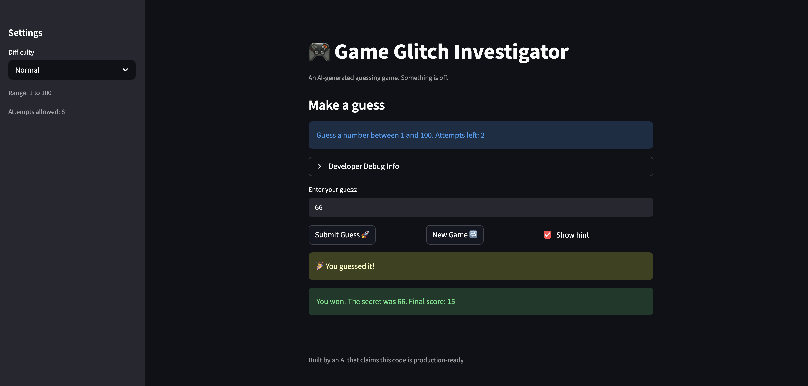

# 🎮 Game Glitch Investigator: The Impossible Guesser

## 🚨 The Situation

You asked an AI to build a simple "Number Guessing Game" using Streamlit.
It wrote the code, ran away, and now the game is unplayable. 

- You can't win.
- The hints lie to you.
- The secret number seems to have commitment issues.

## 🛠️ Setup

1. Install dependencies: `pip install -r requirements.txt`
2. Run the broken app: `python -m streamlit run app.py`

## 🕵️‍♂️ Your Mission

1. **Play the game.** Open the "Developer Debug Info" tab in the app to see the secret number. Try to win.
2. **Find the State Bug.** Why does the secret number change every time you click "Submit"? Ask ChatGPT: *"How do I keep a variable from resetting in Streamlit when I click a button?"*
3. **Fix the Logic.** The hints ("Higher/Lower") are wrong. Fix them.
4. **Refactor & Test.** - Move the logic into `logic_utils.py`.
   - Run `pytest` in your terminal.
   - Keep fixing until all tests pass!

## 📝 Document Your Experience

- [ ] Describe the game's purpose.
The game allows the user to guess a number within a range and gives the user an amount of guesses based on the selected difficulty and tells the user when their guess is too high or too low.
- [ ] Detail which bugs you found.
1. The hint kept saying to go lower, regardless of the guess, and it didn't prevent the user from entering numbers lower than or higher than the range and also didn't give any additional warning messages.
2. The diffferent ranges for difficulty levels don't show in the main UI, it just
says the range is 1-100.
3. The New Game Button doesn't do anything and the game basically just freezes.
4. Tells you that you're out of attempts when you have one attempt left
- [ ] Explain what fixes you applied.
1. I fixed the issue with the hints being inverted by correcting the logic in the check_guess function to return the correct messages based on whether the guess is too high or too low.
2. I fixed the issue with the New Game button not working, and successfully restarted the game whenever it was pressed.

## 📸 Demo

- [ ] [Insert a screenshot of your fixed, winning game here]

## 🚀 Stretch Features

- [ ] [If you choose to complete Challenge 4, insert a screenshot of your Enhanced Game UI here]
